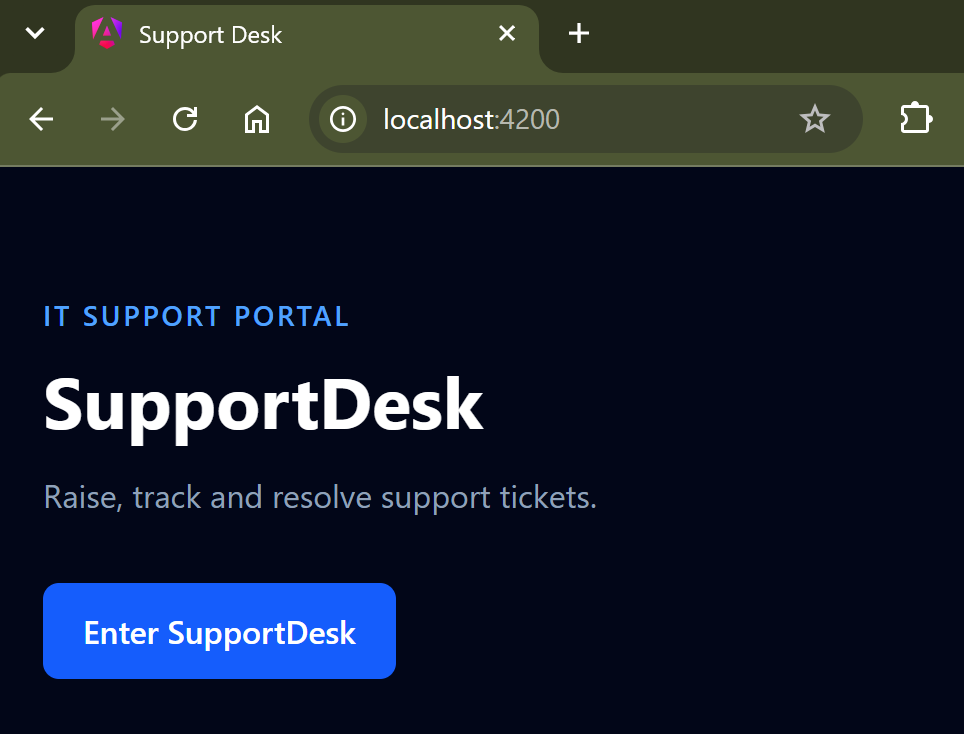
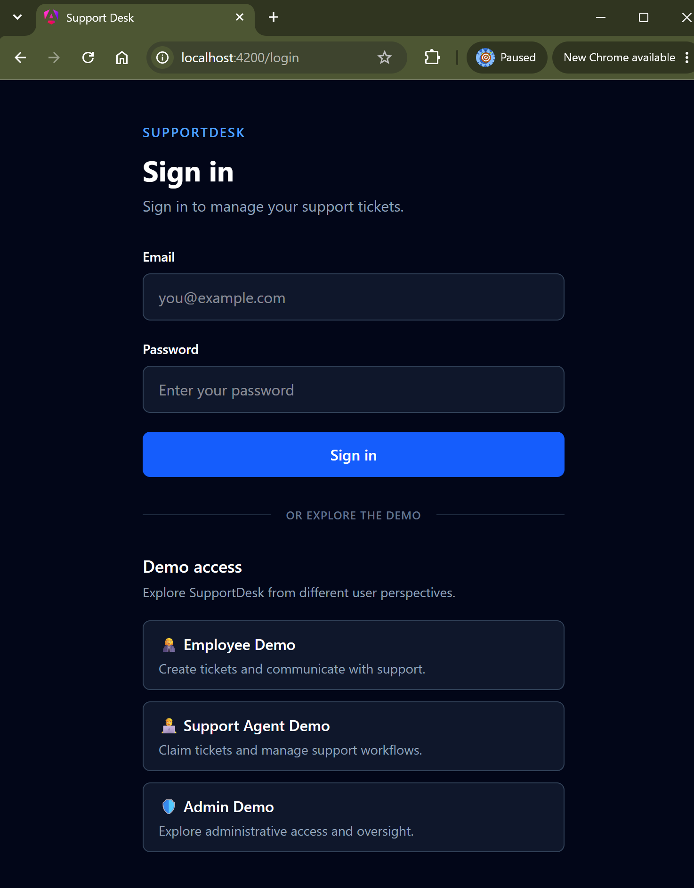
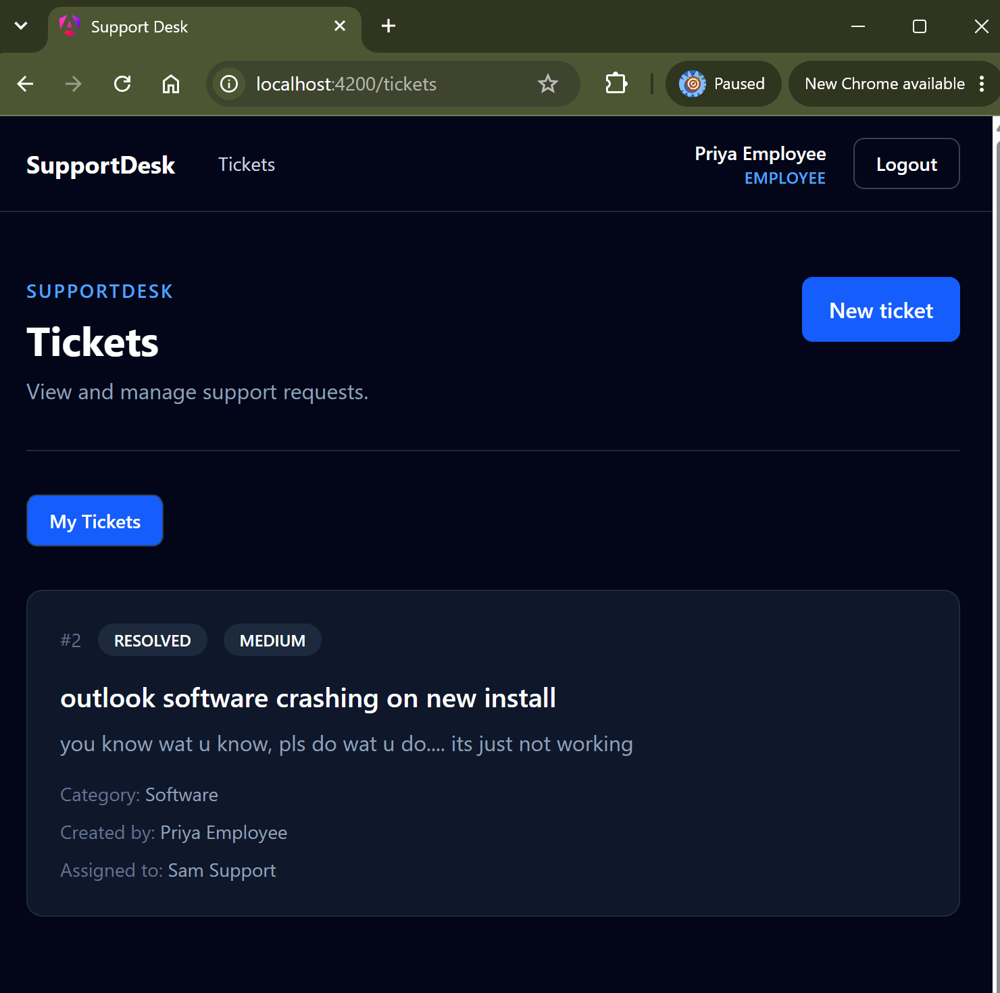
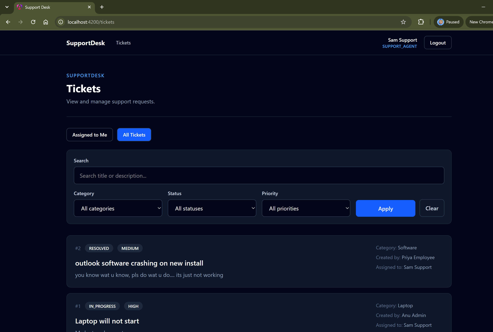
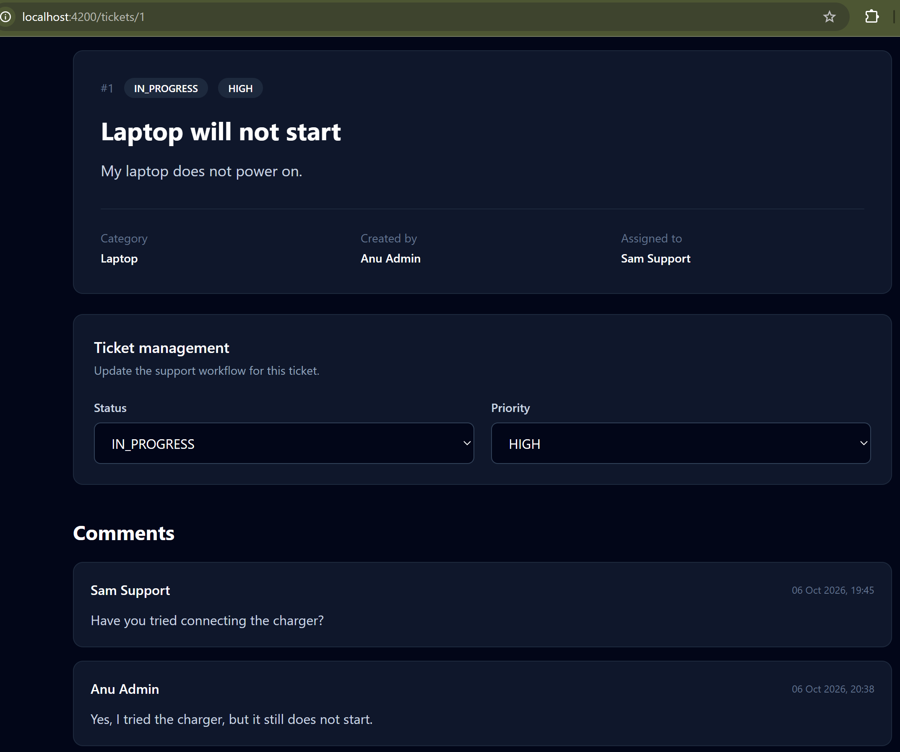
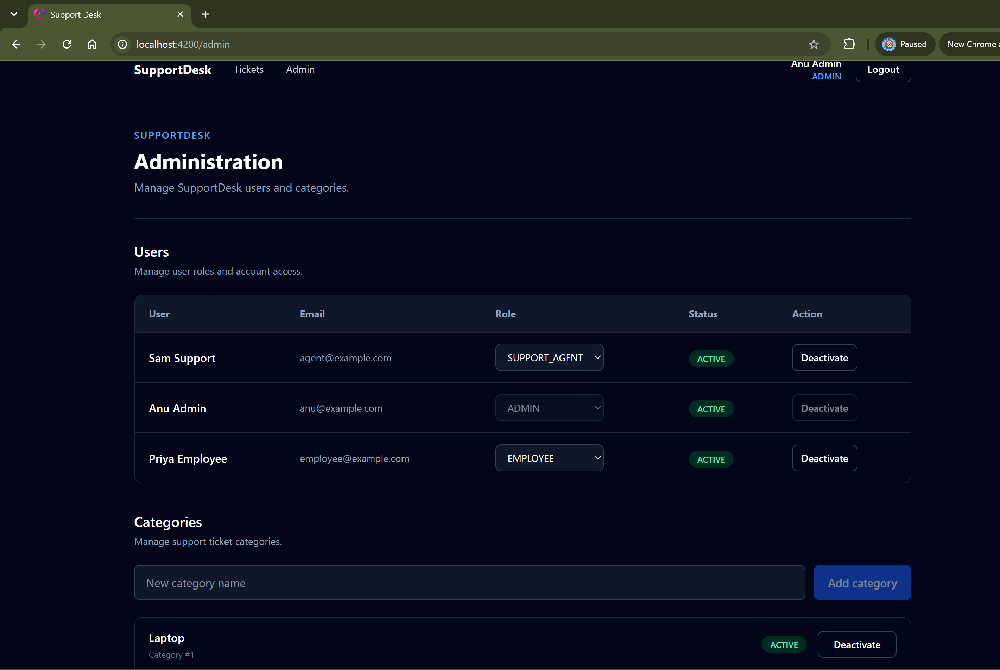

# SupportDesk — Angular Frontend

Frontend application for **SupportDesk**, an internal IT support ticket management system built with Angular.

SupportDesk provides role-based interfaces for employees, support agents, and administrators while communicating with a separate Spring Boot REST API.

---

## Screenshots

### Home


### Demo Login


### Employee Ticket View


### Support Agent Workspace


### Ticket Details


### Administration


## Tech Stack

- Angular
- TypeScript
- Tailwind CSS
- Angular Router
- Angular HttpClient
- Angular Signals
- RxJS
- Template-driven Forms
- JWT Authentication

## User Roles

### Employee

Employees can:

- Create support tickets
- View their own tickets
- Follow ticket status
- Add comments to their own tickets

### Support Agent

Support agents can:

- View available tickets
- Claim open tickets
- View tickets assigned to them
- Search and filter tickets
- Update ticket priority
- Move tickets through the support workflow
- Comment on assigned tickets

### Admin

Administrators can:

- View and manage tickets
- Search and filter all tickets
- Manage users and roles
- Activate or deactivate users
- Create and manage ticket categories

Administrative configuration is available only to authenticated real administrators.

## Demo Access

The login page provides one-click demo access for:

- Employee
- Support Agent
- Admin

Demo users make it possible to explore the different role-based interfaces without requiring credentials.

The Demo Admin can demonstrate ticket-management functionality but cannot access protected user or category administration.

These restrictions are also enforced by the Spring Boot backend.

## Ticket Workflow

```text
OPEN
  ↓
ASSIGNED
  ↓
IN_PROGRESS
  ├──→ WAITING_FOR_USER
  │         ↓
  │    IN_PROGRESS
  │
  └──→ RESOLVED
           ↓
         CLOSED
```

The frontend displays only valid actions for the current ticket state and user role, while the backend remains responsible for enforcing the workflow.

## Features

- JWT-based authentication
- Role-aware navigation
- Route guards
- HTTP authentication interceptor
- Automatic session restoration
- Demo login
- Ticket creation
- Ticket detail view
- Ticket claiming
- Status management
- Priority management
- Ticket comments
- Search and filtering
- Pagination
- User administration
- Category administration
- Responsive interface

## Frontend Security

SupportDesk uses multiple layers of frontend access control for user experience:

```text
Role-aware UI
      ↓
Angular Route Guards
      ↓
Spring Boot API Security
```

Angular hides or disables actions that are not available to the current user.

Route guards prevent navigation to restricted frontend pages.

The Spring Boot backend remains the actual security authority and validates every protected API request.

## Backend API

During local development, Angular runs at:

```text
http://localhost:4200
```

The Spring Boot backend runs at:

```text
http://localhost:8080
```

Angular uses a development proxy so frontend services can use relative API paths such as:

```text
/api/auth
/api/tickets
/api/categories
/api/users
```

without hardcoding the local backend URL throughout the application.

## Running Locally

Install dependencies:

```bash
npm install
```

Start Angular with the development API proxy:

```bash
ng serve --proxy-config proxy.conf.json
```

Then open:

```text
http://localhost:4200
```

The Spring Boot backend must also be running for authentication and ticket operations.

## Backend Repository

The REST API is maintained separately:

[SupportDesk Spring Boot Backend](https://github.com/A-nu-1/supportdesk-backend)

## Project Status

Core SupportDesk v1 functionality is implemented.

Production deployment and hosting configuration are the next stage of the project.

## Author

**Anupama Rajendra**

Software Engineer with experience in enterprise application development, production support, and full-stack web development.

- 🌐 [Portfolio](https://a-nu-1.github.io/anupamaportfolio/)
- 💻 [GitHub](https://github.com/A-nu-1)